--- 
title: "Understanding Risk Perception and Trust in Risk Communication from a Social Identity Approach"
subtitle: ""
author: "Herman Elgueta, PhD - herman.elgueta@umag.cl"
institute: "Universidad de Magallanes"
date: "December 10, 2019 - SRA 2019 - Arlington, VA"
output:
  xaringan::moon_reader:
    lib_dir: libs
    nature:
      highlightStyle: github
      highlightLines: true
      countIncrementalSlides: false
---

# <!-- Slide --> Overview
--

## 1. Theoretical issues
--

## 2. Things in context
--

## 3. Some results
--

## 4. Summary

---
class: inverse, center, middle

# <!-- Slide --> 1. Theory

---

# <!-- Slide --> Why do people oppose or support certain technologies?

--

## a) Beliefs and/or feelings
--
 (and/or attitudes)

--
.pull-left[
###Risk and benefit perceptions

(e.g. Bearth & Siegrist, 2016)
]

--
.pull-right[
###Affect heuristic

(e.g. Slovic, 2007)
]

---

# <!-- Slide --> Why do people oppose or support certain technologies?

--

## b) Trust (or distrust)

(e.g. Slovic, 1993; Earle, 2010; Siegriest, 2019)
--
.pull-left[
###Perceived Competence

]

--
.pull-right[
###Perceived Benevolence

]

---
class: inverse, center
# <!-- Slide --> So... why do people oppose or support certain technologies?

--
.pull-left[
(Attitudes)
## a) Beliefs/feelings about the technology itself
]

--

.pull-right[
(Trust)
## b) Judgements about those involved somehow
]

--

## Okay... 
--

## But where do these attitudes and judgments come from?

---
class:center
# <!-- Slide --> "Social Identity Approach"
--

*"self-perceived belonging to groups"*

--
.pull-left[
## Social Identity Theory
**SIT** (Tajfel & Turner, 1979, 1986)
Intergroup relations
]

--

.pull-right[
## Self-Categorization Theory
**SCT** (Turner et al, 1987)
Intragroup processes
]

---
class:center
# <!-- Slide --> Background: "Accentuation principle"
--

## (Tajfel & Wilkes, 1963)

--
.pull-left[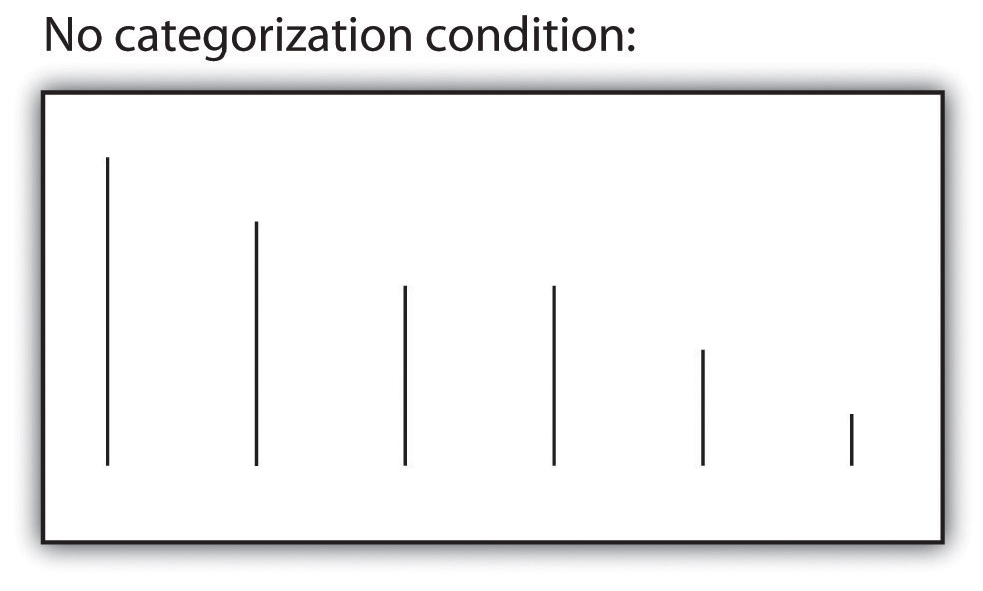]

--
.pull-right[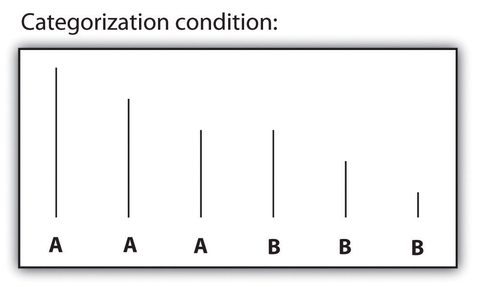]

--

## "stimuli belonging to different classes are judged as farther apart"

---
class:center
# <!-- Slide --> Background: "Minimal group paradigm"

## (Tajfel, 1970)

--

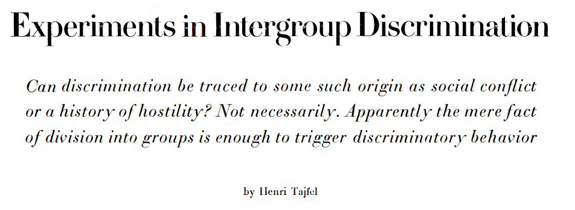

---
class:center
# <!-- Slide --> Social Identity Theory

##(Tajfel & Turner, 1979, 1986)

--

### Ingroup favouritism 
--
(¿Outgroup derogation?)
--

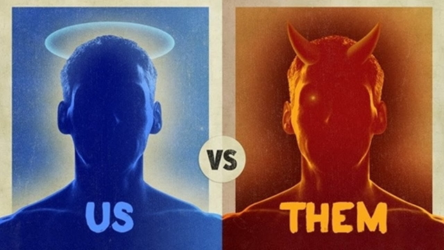

---
class:center
# <!-- Slide --> Social Categorization Theory

## (Turner, 1987)

--

### Deindividuation process 
--
: Normative influence

--

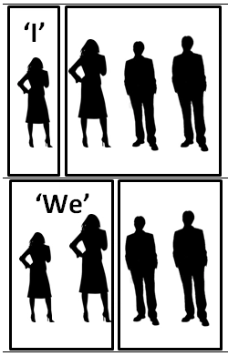

---
class:center,inverse
# <!-- Slide --> So... A "Social Identity Approach" 

--

.pull-left[
## Social Identity Theory
###**In-group favoritism**
]

--

.pull-right[
## Self-Categorization Theory
###**Normative influence**
]

--
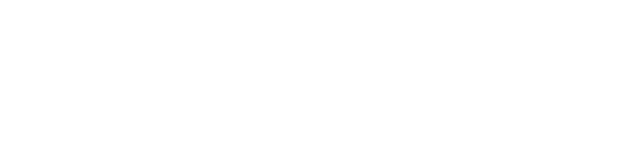

---
class:inverse,center,middle
# <!-- Slide --> 2. Context

---
class:center
# <!-- Slide --> Opposition to power plants in Chile (1)

.pull-left[]
.pull-right[]

---
class:center
# <!-- Slide --> Opposition to power plants in Chile (2)

.pull-left[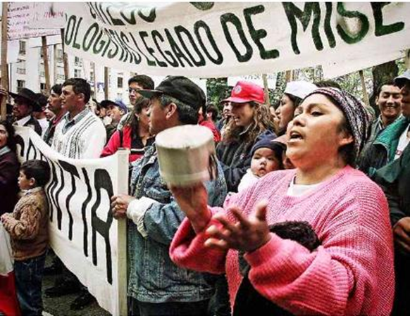]
.pull-right[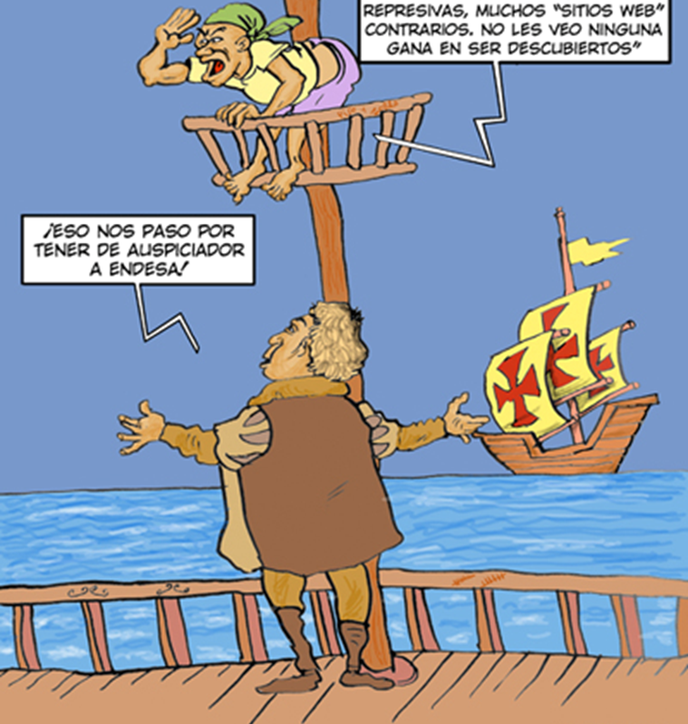]

---
class:center, inverse
# <!-- Slide --> Opposition to power plants in Chile (3)

.pull-left[]
.pull-right[]

---
class:center,middle,inverse
# <!-- Slide --> 3. Some results
---
class:center,inverse	
# <!-- Slide --> SEM Study 1
--

## Survey data: attitudes, trust, identities 

--
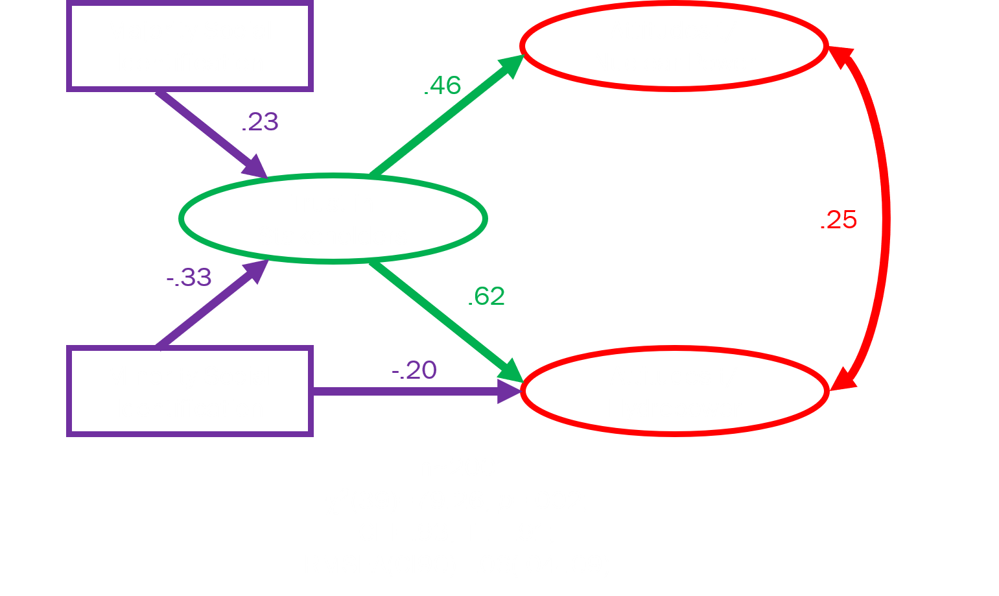

---
class:center,inverse	
# <!-- Slide --> SEM Study 2
--

## Better instruments, larger n

--
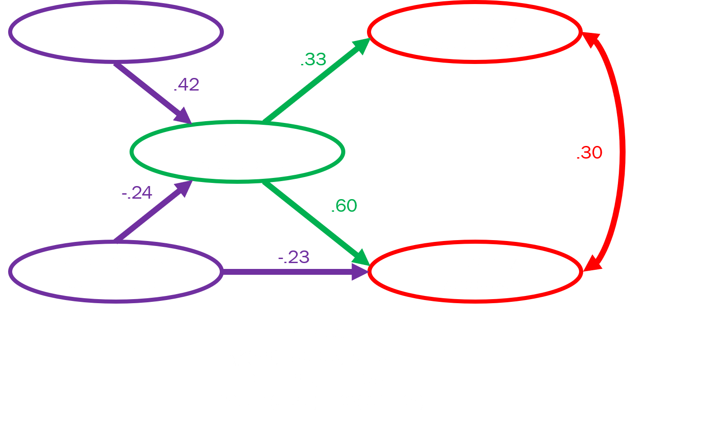

---
class:center,inverse
# <!-- Slide --> Experimental approach
--

### Vignette manipulation about hydro power (3x3 design, n=279)

--

.pull-left[
#### Valence: 1) anti, 2) neutral, 3) pro
#### Source: 1) Establishment, 2) No source, 3) Anti-establishment
### Interaction: source x majority-identification
#### F(2,260)=4.35, p=.014
]

--

.pull-right[
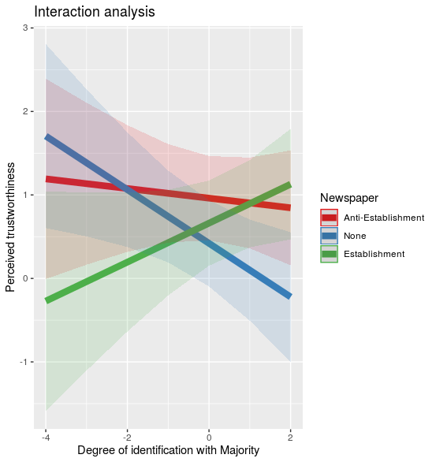
]

---
class:center,inverse,middle
# <!-- Slide --> 4. Summary

---
class:center,inverse
# <!-- Slide --> Summary

##A Social identity approach can provide a framework for understanding risk perception and trust in the context of intergroup phenomena

--

### Social identity theory suggests that in-group favouritism can lead to higher levels of trust towards members of valued ingroups

--

### Social categorization theory suggests that members of groups can be motivated to seek for normative influence from their valued ingroups

---
class:center,inverse,middle
# <!-- Slide --> Thanks

## herman.elgueta@umag.cl
